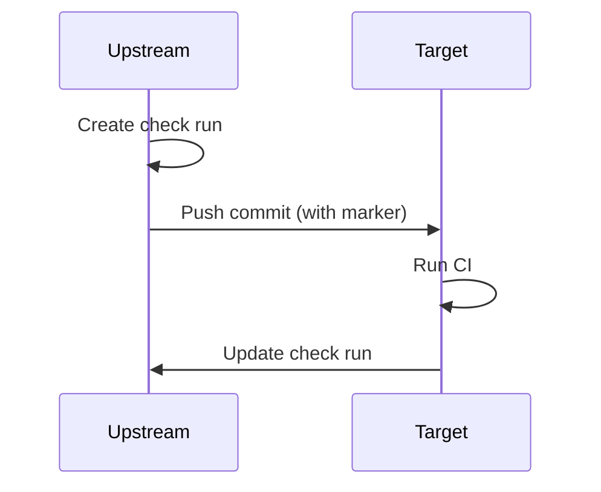

# multi-github-validation-workflows

Cross-validate the same change across multiple GitHub instances. Open a PR
on your "upstream" GitHub, and the same commit is mirrored to one or more
"target" GitHub instances + repos where CI runs and reports back to the
upstream PR as a single, consolidated check.

## Validation flow



The marker embedded in the commit body lets the target CI find its way back
to the upstream check run. Target-native commits never carry a marker, so
the `report` action no-ops when run on unrelated commits.

## Quickstart

Two pieces wire together: a reusable workflow on the upstream side, and the
`report` action on the target side.

**Upstream** — call `push.yaml` from a workflow on your PR trigger:

```yaml
# .github/workflows/cross-validate.yaml in your upstream repo
on:
  pull_request:
    branches: [main]

jobs:
  cross:
    strategy:
      fail-fast: false
      matrix:
        target:
          - { server_url: "https://ghes.eu.example", repository: "qa/app" }
          - { server_url: "https://ghes.us.example", repository: "qa/app" }
    uses: your-org/multi-github-validation-workflows/.github/workflows/push.yaml@v1
    with:
      ref: ${{ github.event.pull_request.head.sha }}
      target_server_url: ${{ matrix.target.server_url }}
      repository: ${{ matrix.target.repository }}
      mode: pr
      sign_commit: true
    secrets:
      upstream_app_id: ${{ secrets.UPSTREAM_APP_ID }}
      upstream_private_key: ${{ secrets.UPSTREAM_APP_PRIVATE_KEY }}
      target_app_id: ${{ secrets.TARGET_APP_ID }}
      target_private_key: ${{ secrets.TARGET_APP_PRIVATE_KEY }}
```

**Target** — call the `report` action from your CI:

```yaml
# .github/workflows/qualify.yaml in your target repo
on:
  push:
    branches: ["cross-validation/**"]
  pull_request:

jobs:
  qualify:
    runs-on: ubuntu-latest
    steps:
      - uses: actions/checkout@v4
      - uses: your-org/multi-github-validation-workflows@v1
        with:
          state: started
          app_id: ${{ secrets.UPSTREAM_APP_ID }}
          private_key: ${{ secrets.UPSTREAM_APP_PRIVATE_KEY }}

      - run: ./scripts/run-tests.sh

      - if: success()
        uses: your-org/multi-github-validation-workflows@v1
        with:
          state: success
          app_id: ${{ secrets.UPSTREAM_APP_ID }}
          private_key: ${{ secrets.UPSTREAM_APP_PRIVATE_KEY }}

      - if: failure()
        uses: your-org/multi-github-validation-workflows@v1
        with:
          state: failure
          app_id: ${{ secrets.UPSTREAM_APP_ID }}
          private_key: ${{ secrets.UPSTREAM_APP_PRIVATE_KEY }}
```

You can also report intermediate progress:

```yaml
- uses: your-org/multi-github-validation-workflows@v1
  with:
    state: in_progress
    progress: 50
    summary: "Integration suite passed; running E2E."
    app_id: ${{ secrets.UPSTREAM_APP_ID }}
    private_key: ${{ secrets.UPSTREAM_APP_PRIVATE_KEY }}
```

The same setup works for *same-instance* validation (push from `org/repo`
to `org/repo-validation` on the same GitHub) — point `target_server_url`
and `repository` at the other repo. If they happen to match the current
repo, the workflow skips automatically.

## GitHub App setup

You need **two** GitHub Apps, one registered on each instance. Each side
stores the *other* side's credentials:

| App | Registered on | Installed on | Credentials stored on | Used by | Permissions |
|-----|---------------|--------------|------------------------|---------|-------------|
| Upstream app | Upstream GitHub (A) | Upstream repo | Target repo (B) | `report` action | `checks: write` |
| Target app | Target GitHub (B) | Target repo | Upstream repo (A) | `push.yaml` | `contents: write`, `pull_requests: write` |

Store each app's `app_id` and PEM private key as repository or organization
secrets on the side that uses them.

When `sign_commit: true`, the target app needs `contents: write` (already
required for the push). Commits created via the Git Data API are
automatically signed by the GitHub App's identity, satisfying branch
protection rules that require signed commits.

## `push.yaml` inputs

| Input | Type | Default | Description |
|-------|------|---------|-------------|
| `ref` | string | *required* | Git ref or SHA to push to the target. |
| `target_server_url` | string | *required* | Server URL of the target GitHub (e.g. `https://github.com` or `https://ghes.example`). |
| `repository` | string | *required* | Target repository in `owner/repo` form. |
| `base_branch` | string | `main` | Base branch when `mode: pr`. |
| `mode` | string | `direct` | `direct` (push to a branch) or `pr` (push and open a PR). |
| `pr_labels` | string | `""` | Space-delimited PR labels. Only applied when `mode: pr`. |
| `draft` | boolean | `false` | When `true` and `mode: pr`, open the downstream PR as a draft. |
| `check_name` | string | `cross-github-validation` | Name of the upstream check run. |
| `branch_prefix` | string | `cross-validation` | Prefix for the target branch name. PR triggers use `<prefix>/pr-<number>`; other triggers use `<prefix>/<short-sha>`. |
| `sign_commit` | boolean | `false` | When `true`, build the amended commit via the Git Data API so it's signed by the target App. |

**Secrets:** `upstream_app_id`, `upstream_private_key`, `target_app_id`,
`target_private_key` — all required.

**Picking a mode:** use `direct` when the target repo's CI runs on push;
use `pr` when CI is gated on pull request, or when you want a visible PR
on the target side for review.

**PR lifecycle (`mode: pr`):** when the upstream trigger is a `pull_request`
event, the action keys the downstream branch by PR number
(`<prefix>/pr-<number>`), so subsequent pushes to the same upstream PR
force-update the same downstream branch and reuse the same downstream PR.
On `pull_request: closed`, the action closes the downstream PR, deletes
the target branch, and posts a `skipped` check run on the upstream
commit. On `pull_request: reopened`, the action recreates the branch and
reopens the previously-closed downstream PR (rather than opening a new
one). To wire up close/reopen handling, include `closed` and `reopened`
in the workflow's `pull_request.types` filter.

## `report` action inputs

| Input | Type | Default | Description |
|-------|------|---------|-------------|
| `state` | string | *required* | One of `started`, `in_progress`, `success`, `failure`, `cancelled`, `skipped`. |
| `progress` | integer | — | 0-100. Only honored when `state: in_progress`; renders a progress bar in the check summary. |
| `summary` | string | — | Short text written to the check run output. |
| `details_url` | string | current run URL on `started` | Override for the check run's `details_url`. |
| `app_id` | string | *required* | Upstream GitHub App ID. |
| `private_key` | string | *required* | PEM-encoded private key for the upstream app. |

### Report states

| state | GitHub status | conclusion |
|-------|---------------|------------|
| `started` | `in_progress` | — |
| `in_progress` | `in_progress` | — |
| `success` | `completed` | `success` |
| `failure` | `completed` | `failure` |
| `cancelled` | `completed` | `cancelled` |
| `skipped` | `completed` | `skipped` |

## Signed commits

Set `sign_commit: true` if the target enforces signed commits via branch
protection. The resulting commit is signed by the target GitHub App's GPG
key. This costs an extra round-trip per push.

## Loop prevention

Because this repo is cloned to every participating GitHub instance, two
guards keep it from looping:

1. `push.yaml` skips when `target_server_url + repository` matches the
   current `github.server_url + github.repository`. This makes the same
   caller workflow safe to install on every instance.
2. The `report` action exits 0 with a notice when the triggering commit
   has no `<!-- upstream-check ... -->` marker. Target-native commits
   never carry the marker.
